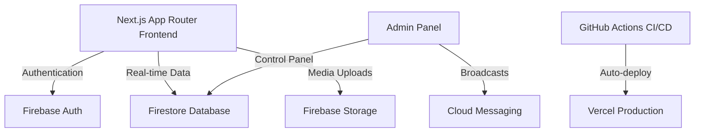

# 💼 JobBoard – Full-Stack Job Portal & Admin Dashboard

[](https://nextjs.org/)
[](https://reactjs.org/)
[](https://www.typescriptlang.org/)
[](https://tailwindcss.com/)
[](https://firebase.google.com/)
[](https://vercel.com/)

**JobBoard** is a premium, high-performance job board portal and admin dashboard platform. Engineered using **Next.js 14 (App Router)**, **TypeScript**, **Tailwind CSS**, and **Firebase**, it delivers a state-of-the-art recruitment experience with an elegant glassmorphism dark theme, optimized SEO, and full mobile responsiveness.

---

## 🏗️ Architecture Flow



---

## ✨ Features

### 👤 Candidate Portal
*   🔍 **Smart Job Board**: Advanced job search with real-time dynamic filters (Job type, Experience Level, Category, Salary Range).
*   🚀 **Interactive Apply Modal**: Sleek glassmorphic application flow with mock file drag-and-drop zones, CV validation, and cover letter entry.
*   ⭐ **Job Bookmarking**: Keep track of favorite listings instantly (persisted state).
*   📝 **Dynamic Resources**: Integrated career guides, interview prep questions, and resume tips.
*   📈 **Top-Tier SEO**: High-speed Server Components with dynamic meta tag rendering for search engine crawlers.

### 📊 Admin Control Center
*   📈 **Live Traffic Analytics**: Sleek interactive dashboards showing application counters, CTR, impressions, and user signups.
*   💼 **Jobs CRUD Operations**: Manage job categories, toggle listings, and highlight "Featured" roles.
*   🏢 **Company Management**: Verify brand pages and toggle verification badges instantly.
*   📝 **Blog Engine**: Publish articles, update slugs, and preview drafts on the live site.
*   📣 **Ad Server**: Manage placements (banners, sidebars, inline advertisements) with click & impression tracking.
*   🔔 **Push Notifications**: Broadcast promotions and system announcements to targeted user groups.

---

## 🛠️ Technology Stack

| Layer | Technology | Purpose |
|---|---|---|
| **Core** | Next.js 14 (App Router), React 18, TypeScript | High-speed Server Side Rendering & static page compilation. |
| **Backend / DB** | Firebase (Auth, Firestore, Cloud Storage) | Real-time database updates, authentication, and CV asset hosting. |
| **Styling** | Tailwind CSS, Vanilla CSS | Sleek Glassmorphism layout with modern UI tokens. |
| **Icons** | Lucide React | Modern, lightweight iconography. |
| **Date Utils** | Date-fns | Relative time parsing (e.g. "2 hours ago"). |
| **CI / CD** | GitHub Actions & Vercel API | Automated testing, compilation validation, and live deployment. |

---

## 🚀 Setup & Installation

Follow these steps to run JobBoard locally or deploy it to production.

### Prerequisites
*   Node.js (v18 or higher)
*   npm (v9 or higher)
*   A Firebase Account

---

### Step 1: Clone and Install
```bash
git clone https://github.com/parameshmagapu2001/Job_Board.git
cd Job_Board
npm install
```

### Step 2: Configure Environment Variables
Create a `.env.local` file in the root directory and append your Firebase configuration parameters:

```env
NEXT_PUBLIC_FIREBASE_API_KEY=your_api_key_here
NEXT_PUBLIC_FIREBASE_AUTH_DOMAIN=your_auth_domain_here
NEXT_PUBLIC_FIREBASE_PROJECT_ID=your_project_id_here
NEXT_PUBLIC_FIREBASE_STORAGE_BUCKET=your_storage_bucket_here
NEXT_PUBLIC_FIREBASE_MESSAGING_SENDER_ID=your_sender_id_here
NEXT_PUBLIC_FIREBASE_APP_ID=your_app_id_here
```

### Step 3: Run Locally
```bash
npm run dev
```
Open **[http://localhost:3000](http://localhost:3000)** in your browser to view the application.

---

## 🛠️ Build and Production Deployment

### Local Compilation Test
To compile and test the optimized Next.js build locally:
```bash
npm run build
npm run start
```

### Deploying to Vercel
Deploy to production via Vercel CLI:
```bash
npm install -g vercel
vercel --prod
```
Ensure all variables defined in `.env.local` are added under the **Environment Variables** settings in your Vercel Dashboard.

---

## 🔄 CI/CD Pipeline Integration

JobBoard is equipped with an automated GitHub Actions pipeline (`deploy.yml`). On every push to `main`, the pipeline automatically:
1. Runs compilation and type verification audits (`Linting & checking types`).
2. Bundles the production Next.js build.
3. Automatically deploys the update to your live Vercel environment.

To configure this integration, set up the following secrets under **Settings -> Secrets and variables -> Actions** in your GitHub repository:
*   `VERCEL_TOKEN`: Vercel Account Personal Access Token.
*   `VERCEL_ORG_ID`: Vercel scope/organization ID.
*   `VERCEL_PROJECT_ID`: Vercel Project ID.

---

## 📂 Project Structure

```
src/
├── app/                  # Next.js App Router page components
│   ├── admin/            # Admin control panels
│   ├── auth/             # Sign-in & register screens
│   ├── jobs/             # Job search grids & details
│   ├── blog/             # Resource articles list & pages
│   └── ...               # Additional static routes
├── components/           # Reusable components
│   ├── admin/            # Admin layouts & sidebar
│   ├── home/             # Hero, stats, & CTA blocks
│   ├── jobs/             # Job card, apply actions, & list grids
│   └── layout/           # App navigation headers & footers
├── data/                 # Central data stores (jobsData, adminData)
├── firebase/             # configuration & CRUD services
├── types/                # Core TypeScript interfaces
└── styles/               # Global styling configurations
```

---

## 📄 License
This project is licensed under the MIT License.
